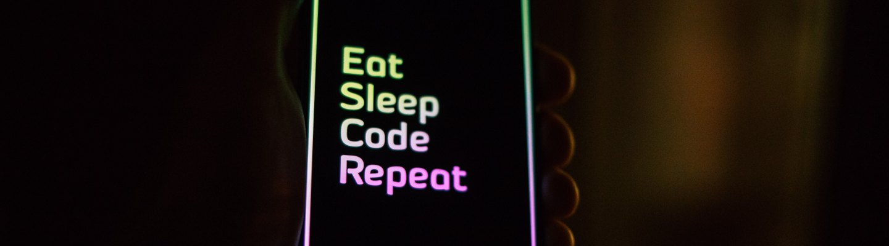

  

<h1 align="center">Spacetraveling Blog</h1>
<h3 align="center">Por André Altoé</h3>

  

<!-- TABLE OF CONTENTS -->
<h2 id="summary"> :book: Sumário</h2>

  
Sumário

  <ol>
    <li><a href="#sobre"> ➤ Sobre</a></li>
    <li><a href="#tecnologias"> ➤ Tecnologias</a></li>
     <li><a href="#como-rodar"> ➤ Como Rodar</a></li>
    <li><a href="#creditos"> ➤ Creditos</a></li>
  </ol>

<!-- ABOUT THE PROJECT -->
<h2 id="sobre"> :pencil: Sobre</h2>

Desafio referente ao terceiro módulo do curso Ignite na Rocketseat, onde nos foi dado o objetivo de criar um blog com next.js consumindo os dados de um backend remoto com um headless CMS chamado Prismic.

<!-- ABOUT THE PROJECT -->
<h2 id="tecnologias"> :hammer: Tecnologias</h2>

<ul>
    <li></li>
    <li><a href="https://nextjs.org/" title="Next.js"> Next Js</a></li>
    <li><a href="https://www.typescriptlang.org/" title="Typescript"> Typescript</a></li>
    <li><a href="https://reactjs.org/" title="React"> React Js</a></li>
    <li><a href="https://yarnpkg.com/" title="Yarn"> Yarn</a></li>
    <li><a href="https://code.visualstudio.com/" title="Visual Studio Code"> Visual Studio Code</a></li>
</ul>

<!-- ABOUT THE PROJECT -->
<h2 id="como-rodar"> :nut_and_bolt: Como Rodar</h2>

Para rodar essa aplicação localmente é necessário que você primeiro crie sua conta no Prismic e configure suas variáveis de ambiente com as seguintes chaves:

<pre><code>PRISMIC_API_ENDPOINT
PRISMIC_ACCESS_TOKEN</code></pre>

    Você pode rodar o projeto em ambiente de desenvolvimento simplesmente digitando os seguintes comandos em seu terminal:

<pre><code>$ yarn
$ yarn dev</code></pre>

<!-- ABOUT THE PROJECT -->
<h2 id="creditos"> :eyeglasses: Creditos</h2>

> Feito com 💙 Por André Altoé :wave:

Durante o curso Ignite da Rocketseat
